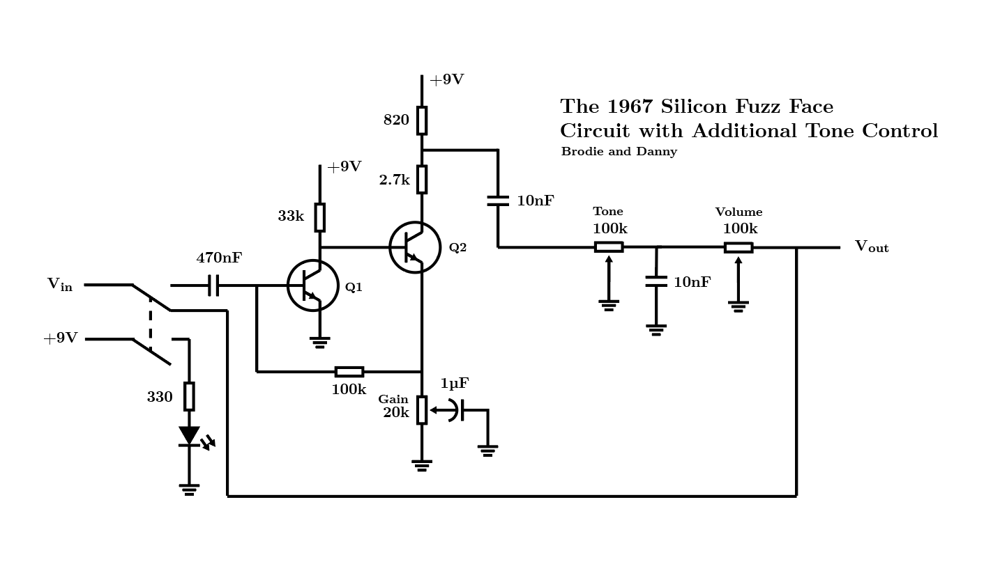

# 1967-Silicon-Fuzz-Face-Circuit
The Germanium Fuzz Face and Silicon Fuzz Face are some of the most ubiquitous sounds in 1960s and 70s Rock n’ Roll, named after the transistors used in them. In this project we recreate this pedal circuit with more modern parts and add additional tone control which the original pedal was noticeably missing. Read the full paper [here](Paper/Recreating%20the%201967%20Silicon%20Fuzz%20Face%20Circuit%20with%20Additional%20Tone%20Control.pdf).

